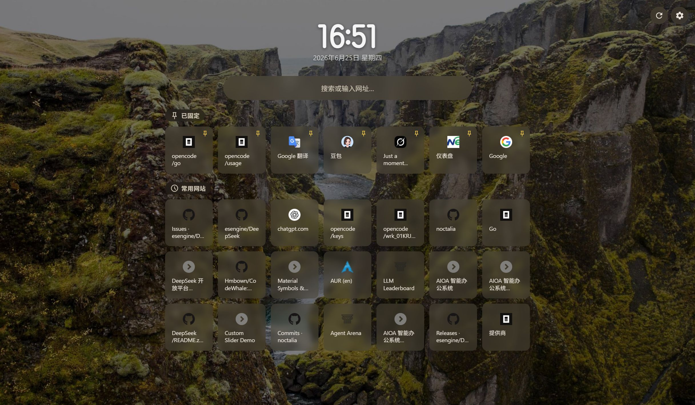

# Portab — 极简新标签页，常用网站 + 每日壁纸 + Material You 主题

Portab 是一个 Chrome / Brave 新标签页扩展，自动展示最常访问的网站，支持必应每日壁纸、Material You 动态主题色。

## 功能

- **常用网站** — 按访问次数自动排列前 36 个站点，支持固定到顶部区域
- **搜索引擎** — 内置 Google / Bing / 百度 / DuckDuckGo / Yahoo 等多引擎切换，支持自定义搜索
- **壁纸** — 必应每日 / Picsum 随机 / NASA 天文 / 自定义图片，支持遮罩和模糊调节
- **主题** — 暗色 / 亮色 / 跟随系统，Material Design 3 (Material You) 动态主题色，自动从壁纸取色
- **时钟** — 毛玻璃效果 + 边缘光晕，支持 12/24h 格式、字体、字重、间距自定义
- **历史范围** — 7天 / 30天 / 90天 / 全部，支持屏蔽指定站点

## 截图

## 安装

1. 打开 `chrome://extensions`
2. 开启**开发者模式**
3. 点击**加载未打包的扩展程序**
4. 选择 `Portab` 文件夹
