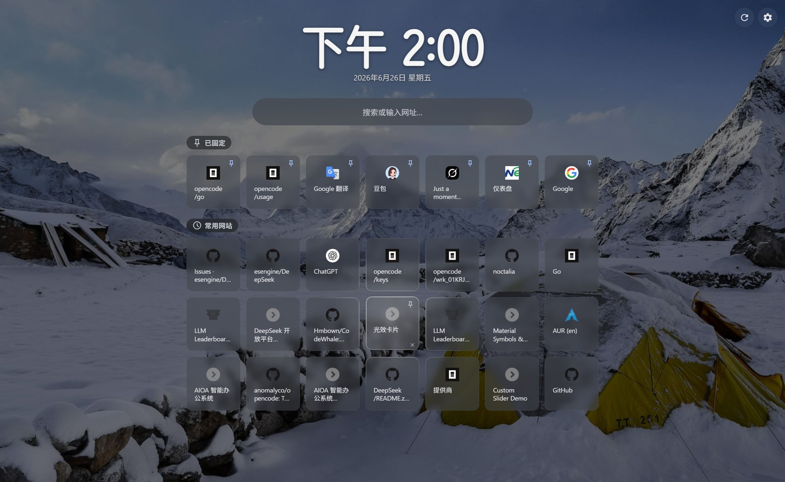
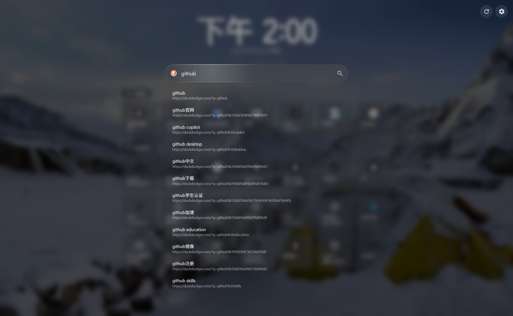
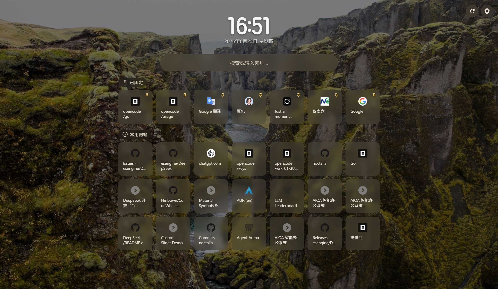
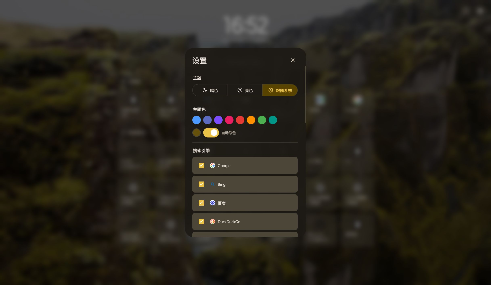

# Portab

使用 Brave 浏览器时很喜欢它的新标签页中的常用网站功能，但显示得太少了，用起来不够方便，所以用 AI 做了这个扩展。

## 功能

- **常用网站** — 按访问次数自动排列，支持固定到顶部区域
- **壁纸** — 必应每日 / 随机 / 自定义图片，支持遮罩和模糊
- **主题** — 暗色 / 亮色 / 跟随系统，自定义主题色，自动从壁纸取色

## 截图

## 安装

1. 打开 `chrome://extensions`
2. 开启**开发者模式**
3. 点击**加载未打包的扩展程序**
4. 选择 `Portab` 文件夹
